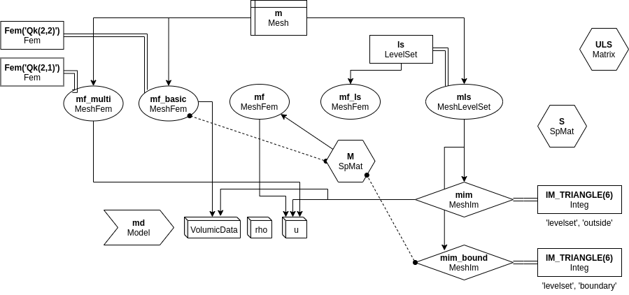
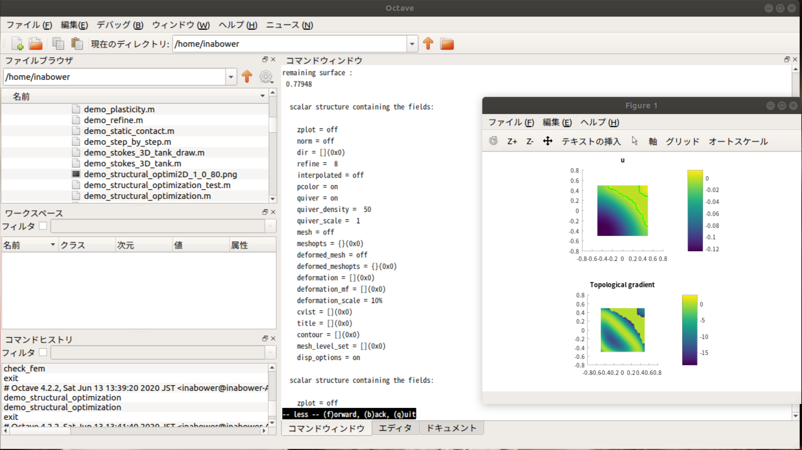

# はじめに

このファイルは自分が理解するための勉強メモです。
間違った内容が書かれている可能性がとても高いためご注意ください。
また、もし記載されている内容で間違いを発見した場合には優しい言葉で訂正いただくと嬉しいです。


### 勉強リスト：教材

- 有限要素法：（書籍）[非線形有限要素法のための連続体力学/Javier Bonet, Richard D. Wood](amazon.co.jp/dp/4627675127)
- トポロジー最適化：（書籍）[トポロジー最適化/西脇 眞二](amazon.co.jp/dp/4621086340)
- GetFEMのFEM手法：（web）[付録A.有限要素法リスト](https://getfem.readthedocs.io/ja/latest/userdoc/appendixA.html)
- GetFEMの積分手法：（web）[付録B.立体求積法のリスト](https://getfem.readthedocs.io/ja/latest/userdoc/appendixB.html)
- レベルセット法

### 疑問点

- `MeshFem.eval()`で使用する変数は空になってしまうけどこれでいいのか。うまい使い方は？
- `gf.asm_???(~~)`と`gf.asm('???',~~)`みたいに2パターンあるけどこれはどちらのほうがいいのか
- 

# モチベーション

以前より構造解析はやりたいとは思っていましたが、様々な言い訳により手を付けることができていませんでした。今回はトポロジー最適化でやってみたいことがありますのでそれをモチベーションに頑張っていきます。

# チュートリアルの写経

今回は幸いにもやりたいことがはっきりとしているので、同じ内容のチュートリアルを探します。
すると以下の２つが今回の目標であるトポロジー最適化の内容であると推測されました。

- topological optimization
  - `interface/tests/matlab-octave/demo_topological_optimization.m`
  - `interface/tests/scilab/demo_topological_optimization.sce`
- structural optimization
  - `interface/tests/matlab-octave/demo_structural_optimization.m`
  - `interface/tests/scilab/demo_structural_optimization.sce`

これらを写経していきたいと思います。
最終的にはPythonで実行する予定なので、これらをPythonに翻訳しながら同じ動作をすることを目標にしていきます。
なおmatlabの環境はないため、今回はoctaveでの実行を基準にしていきます。

## `interface/tests/matlab-octave/demo_topological_optimization.m`

最終的に以下のような結果が得られました。
右の図では元々の応力場に影響の少ない場所をゴリゴリ削っていっている感じでしょうか。
これを写経しながら理解していくことがまず今回の目標です。


登場するオブジェクト



コード冒頭：

```MATLAB
%  Shape optimization with topological gradient
%   (with a fictitious domain approach).
%
%  This program is used to check that matlab-getfem is working. This is
%  also a good example of use of GetFEM++.
```


## 実行結果



とりあえず動かしてみました。
下の図で影響の少ない要素を除外していってる感じでしょうか。
それではこれを写経していきます。

# Pythonによる写経

それではこれをPythonで実行できるように書き写していきます。

## パラメーターの設定とメッシュの作成

- matlab/octave ーーーーーーーーーーーーーーーーーーーーーーーーーー

```MATLAB
gf_workspace('clear all');

% parameters
NX=30;
ls_degree = 1;
alpha = 1;
beta = 1;
rayon_trous = 0.2;

% Finite element and integration methods definition
m=gfMesh('cartesian', -.5:(1/NX):.5, -.5:(1/NX):.5);
% m=gfMesh('triangles grid', -.5:(1/NX):.5, -.5:(1/NX):.5);
% mim=gfMeshIm(m, gf_integ('IM_GAUSS_PARALLELEPIPED(2,4)'));
```

- Python ーーーーーーーーーーーーーーーーーーーーーーーーーー

```python
import getfem as gf
import numpy as np

# parameters
NX=30;
ls_degree = 1;
alpha = 1;
beta = 1;
rayon_trous = 0.2;

m = gf.Mesh('cartesian', np.arange(-.5,.5+1./NX,1./NX), np.arange(-.5,.5+1./NX,1./NX))
```

この辺は基本的にコピペです。Pythonではセミコロンはあってもなくてもいいので雑にコピペしています。
要素の分割についてはnumpyで同じ分割をできるように調整しています。1.0×1.0の正方形領域を30×30で分割した構造メッシュを作成することができました。

## 有限要素法の手法の設定と変数の定義

- matlab/octave ーーーーーーーーーーーーーーーーーーーーーーーーーー

```MATLAB
mf_basic=gfMeshFem(m, 1);
gf_mesh_fem_set(mf_basic,'fem',gf_fem('FEM_QK(2,2)'));
mls=gfMeshLevelSet(m);
ls=gfLevelSet(m, ls_degree);
set(mls, 'add', ls);
mf_ls=gfObject(get(ls, 'mf'));
P=get(mf_ls, 'basic dof nodes');
x = P(1,:); y = P(2,:);
ULS=1000*ones(1,numel(x));
```

- Python ーーーーーーーーーーーーーーーーーーーーーーーーーー

```python
mf_basic = gf.MeshFem(m, 1);
mf_basic.set_fem(gf.Fem('FEM_QK(2,2)'))
mls = gf.MeshLevelSet(m)
ls  = gf.LevelSet(m, ls_degree)
mls.add(ls)
mf_ls = ls.mf()

P = mf_ls.basic_dof_nodes()
x = P[0]
y = P[1]
ULS = 1000*np.ones(x.shape)
```
この辺からは調べながら書いていくことになります。

ここではFEMオブジェクト`gf.Fem(method)`をメッシュと連携させているようです。
[getfem.org](http://getfem.org/python/cmdref_Fem.html)によると`gf.Fem()`ではFEM手法を文字列で指定する形になっており、
`FEM_QK(2,2)`は「四角形/六面体要素(Q)で2次要素(前の2)の2次元(後ろの2)」を示しているようです。
条件の文字列指定はメタプログラミングを前提としている感じでテクくていいですね。

また、各要素と境界面との距離であるレベルセットは`gf.MeshLevelSet(m)`で設定されているみたいです。
ラグランジュ表現の次元を第二引数で指定しているとのことです。

`Mesh`と`Fem`を`MeshFem`で、`Mesh`と`LevelSet`を`MeshLevelSet`で接続しているようです。
`mf()`は`LevelSet`から得られる`MeshFem`みたいです。

ULSは名前からしてレベルセットの値でしょうか。初期値は1000で、おそらく無限に遠いとしているのかと。。

[GetFEMのドキュメント](https://getfem.readthedocs.io/ja/latest/python/pygf.html)によると、
基本的にmatlab/octaveとPythonで関数が対応するように作成されているとのことでしたので、

1. 初手として`gf_func`→`gf.func`を試す
2. 動かなかったらそのキーワードを元にpythonチュートリアル内をgrep
3. ググる

のような方針で探っていってみました。

また、octaveとPythonで同じ動作をしているのかを確認するため、各変数の中身を確認しながらステップ実行していきます。
octaveは標準のIDEでその機能があり、Python側はJupyter labの`@lckr/jupyterlab_variableinspector`エクステンションを使用しました。

これで変数内の値やshapeを確認しながら書き写していきました。

## 最適化ループ①

- matlab/octave ーーーーーーーーーーーーーーーーーーーーーーーーーー

```MATLAB
% Loop on the topological optimization
while(1) 

  gf_workspace('push');

  set(ls, 'values', ULS);

  set(mls, 'adapt');

  mim_bound = gfMeshIm('levelset',mls,'boundary', gf_integ('IM_TRIANGLE(6)'));
  mim = gfMeshIm('levelset',mls,'outside', gf_integ('IM_TRIANGLE(6)'));
  set(mim, 'integ', 4);
  mf_mult=gfMeshFem(m); set(mf_mult, 'fem', gf_fem('FEM_QK(2,1)'));

  M = gf_asm('mass matrix', mim, mf_basic);
  D = abs(full(diag(M)));
  ind = find(D > 1E-8);

  mf = gf_mesh_fem('partial', mf_basic, ind);


  S = gf_asm('volumic','V()+=comp()',mim);
  disp('remaining surface :'); disp(S);
```

- Python ーーーーーーーーーーーーーーーーーーーーーーーーーー

```python
#% Loop on the topological optimization

#while True:
for col in range(1000):
    ls.set_values(ULS)
    mls.adapt()
    mim_bound = gf.MeshIm('levelset',mls,'boundary', gf.Integ('IM_TRIANGLE(6)')) 
    mim = gf.MeshIm('levelset',mls,'outside', gf.Integ('IM_TRIANGLE(6)'))
    mim.set_integ(4)

    mf_mult = gf.MeshFem(m)
    mf_mult.set_fem(gf.Fem('FEM_QK(2,1)'))
    
    M = gf.asm_mass_matrix(mim, mf_basic)
    D = np.abs(M.diag().T[0])
    ind = np.argwhere(D>1e-8)
    mf = gf.MeshFem('partial', mf_basic, ind)

    S = gf.asm('volumic','V()+=comp()',mim)
    print('remaining surface :',S)
```

ここからは最適化のためのループが行われています。

adapt()はレベルセットを適用する関数のようです。
ループの中でULSを計算し、その値を用いて一部の要素を除外するといった流れでしょうか。

`MeshIm`は積分手法を決定する部分で今回の`IM_TRIANGLE(6)`は6次の三角形ガウス求積を行う**(要調査)**
([設定可能な選択肢](http://getfem.org/python/cmdref_Integ.html)), ([積分手法](https://www.ics.nara-wu.ac.jp/~kako/teaching/na/chap6.pdf))

これをレベルセットにより得られる領域の`boundary`と`outside`について行っているようです。

そして新たなMeshFemオブジェクト`mf_multi`も作成されました。二次元の一次要素を設定しているようです。

`M`は`mf_basic`と`mim`(`boundary`の積分手法)から得られる疎行列(`SpMat`オブジェクト)のようです。この値が1e-8を超えている領域のみに対して得られる`MeshFem`オブジェクトがmfになるようです。名前からしてこいつが主役でしょうか。あとさっきの`mim`から表面に関する情報`S`を算出しているようです。


## 問題の定義

- matlab/octave ーーーーーーーーーーーーーーーーーーーーーーーーーー

```MATLAB
  % Problem definition (Laplace(u) + u = f)
  md=gf_model('real');
  gf_model_set(md, 'add fem variable', 'u', mf);
  gf_model_set(md, 'add Laplacian brick', mim, 'u');
  gf_model_set(md, 'add fem data', 'VolumicData', mf_basic);
  gf_model_set(md, 'add source term brick', mim, 'u', 'VolumicData');
  gf_model_set(md, 'add initialized data', 'rho', [1.]);
  gf_model_set(md, 'add mass brick', mim, 'u', 'rho');
  gf_model_set(md, 'add multiplier', 'mult_dir', mf_mult, 'u');
  % To be completely robust, a stabilization should be used on the Dirichlet
  % boundary to ensure the inf-sup condition (Nitsche or Barbosa-Hughes)
  gf_model_set(md, 'add Dirichlet condition with multipliers', ...
	       mim_bound, 'u', 'mult_dir', -1);

  % Solving the direct problem.
  U0 = gf_mesh_fem_get(mf_basic, 'eval', ...
                       { '0.4*(3.*sin(pi*(x+y)) + ((x-0.5).^10 + (y-0.5).^10 + (x+0.5).^10 + (y+0.5).^10))' });
  gf_model_set(md, 'variable', 'VolumicData', U0);
  gf_model_get(md, 'solve');
  U = gf_model_get(md, 'variable', 'u');
```

- Python ーーーーーーーーーーーーーーーーーーーーーーーーーー

```python
    # % Problem definition (Laplace(u) + u = f)
    md = gf.Model('real')
    md.add_fem_variable('u', mf)
    md.add_Laplacian_brick(mim, 'u')
    md.add_fem_data('VolumicData', mf_basic)
    md.add_source_term_brick(mim, 'u', 'VolumicData')
    md.add_initialized_data('rho', [1.0])
    md.add_mass_brick(mim, 'u', 'rho')
    md.add_multiplier('mult_dir', mf_mult, 'u')
    # % To be completely robust, a stabilization should be used on the Dirichlet
    # % boundary to ensure the inf-sup condition (Nitsche or Barbosa-Hughes)
    md.add_Dirichlet_condition_with_multipliers(mim_bound, 'u', 'mult_dir', -1)

    # % Solving the direct problem.
    U0 = mf_basic.eval('0.4*(3.*np.sin(np.pi*(x+y)) + ((x-0.5)**10 + (y-0.5)**10 + (x+0.5)**10 + (y+0.5)**10))', globals(), locals())
    U0 = np.array([U0])
    md.set_variable('VolumicData', U0)

    md.solve()
    U = md.variable("u")
```

ここでは解くべき問題を定義しているようです。[gf.Model](http://getfem.org/python/cmdref_Model.html)

- `'real'`は実数モデルであることを示している。
- `u`という変数を定義
- `Δu`の項をセット(レベルセットの外側mimをセット)
- 'VolumicData'というFEMデータを全体の領域`mf_basic`についてセット
- これをuのソース項にしているのかな？
- 初期値として`rho`（密度？）を1でセット
- これを質量項としてセット
- さっきの`mf_multi`を掛け算しているっぽい
- 掛け算した上でディリクレ境界条件を設定

ここまでやっていることはおそらくレベルセットにより除外されていない領域のみで応力の計算を行うといったものだと思っています。今のところは以下のような感じ？

$$ \rho ( \Delta u + u ) = 0 $$

ここに以下のようなU0がVolumicDataとしてセットされています。

$$ U_0 = 0.4 * ( 3 * sin( \pi * (x+y) ) + (x-0.5)^{10} + (y-0.5)^{10} + (x+0.5)^{10} + (y+0.5)^{10}) $$

そしてこれを解き、得られるUでこれから何かを行うようです。

`MeshFem.eval()`の後ではその中で使用したxとyの中身がなくなっていることを確認済み。
通常のevalと違う扱いに注意する必要がありそう。

## アジョイント法とトポロジー勾配の計算

- matlab/octave ーーーーーーーーーーーーーーーーーーーーーーーーーー

```MATLAB
  % Solving the adjoint problem.
  UBASIC = gf_compute(mf, U, 'interpolate on', mf_basic);
  F = 2*(UBASIC-U0);
  gf_model_set(md, 'variable', 'VolumicData', F);
  gf_model_get(md, 'solve');
  W = gf_model_get(md, 'variable', 'u');


  % Computation of the topological gradient
  mf_g=gfMeshFem(m, 1);
  gf_mesh_fem_set(mf_g,'fem', ...
   gf_fem('FEM_PRODUCT(FEM_PK_DISCONTINUOUS(1,2),FEM_PK_DISCONTINUOUS(1,2))'));
  DU = gf_compute(mf, U, 'gradient', mf_g);
  DW = gf_compute(mf, W, 'gradient', mf_g);
  nbdof = gf_mesh_fem_get(mf_g, 'nbdof');
  DU = reshape(DU, 2, nbdof);
  DW = reshape(DW, 2, nbdof);

  UU = gf_compute(mf, U, 'interpolate on', mf_g);
  UU0 = gf_compute(mf_basic, U0, 'interpolate on', mf_g);
  LS = gf_compute(mf_ls, ULS, 'interpolate on', mf_g);

  G = (-4*pi*( alpha*(DU(1,:).^2 + DU(2,:).^2 + DU(1,:).*DW(1,:) + ...
       DU(2,:).*DW(2,:)) + beta*(UU-UU0).^2)) .* (sign(LS)+1.)/2;
```

- Python ーーーーーーーーーーーーーーーーーーーーーーーーーー

```python
    # % Solving the adjoint problem.
    UBASIC = gf.compute_interpolate_on(mf, U, mf_basic)
    F = 2*UBASIC
    md.set_variable('VolumicData', F)
    md.solve()
    W = md.variable("u")

    # % Computation of the topological gradient
    mf_g = gf.MeshFem(m, 1)
    mf_g.set_fem(gf.Fem('FEM_PRODUCT(FEM_PK_DISCONTINUOUS(1,2),FEM_PK_DISCONTINUOUS(1,2))'))
    DU = gf.compute(mf, U, 'gradient', mf_g);
    DW = gf.compute(mf, W, 'gradient', mf_g);
    nbdof = mf_g.nbdof()
    DU = np.reshape(DU, [2, nbdof])
    DW = np.reshape(DW, [2, nbdof])
    
    UU = gf.compute_interpolate_on(mf, U, mf_g)
    UU0 = gf.compute_interpolate_on(mf_basic, U0, mf_g)
    LS = gf.compute_interpolate_on(mf_ls, ULS, mf_g)

    G = (-4*np.pi*( alpha*(DU[0]**2 + DU[1]**2 + DU[0]*DW[0] + DU[1]*DW[1]) + beta*(UU-UU0)**2)) * (np.sign(LS)+1.)/2;
```

さっきのUをmf_basicのメッシュに合うように内挿している感じでしょうか。それを二倍した上で先程のモデルのVolumicDataにしています。そしてそこで得られた`u`は`W`としてこの後使用されるようです。

ここで更にあたらしい`MeshFem`の`mf_g`を使用するようです。
`FEM_PRODUCT()`でプリズム上のLagrande要素を構成するとのこと。[付録A.有限要素法リスト](https://getfem.readthedocs.io/ja/latest/userdoc/appendixA.html)

|degree|dimension|d.o.f. number|class|vector|τ-equivalent|Polynomial|
|:---:|:---:|:---:|:---:|:---:|:---:|:---:|
|$K_1+K_2, 0≤K_1,K_2≤255$|$P ,  2≤P≤255$|$(K_2)+1×\frac{(K_1+P-1)!}{K_1!(P-1)!}$|$C^0$|No $(Q=1)$|Yes $(M=Id)$|Yes|

この高次要素を使ってUとWの勾配を算出している感じでしょうか。

その後、`compute_interpolate_on()`でUとU0とULSを`mf_g`にマッピングして、
最終的にこれらからGを算出しているようです。

When $LS>0$
$$ G = -4 \pi ( \alpha ( DU_x^2 + DU_y^2 + DU_x DW_x + DU_y DW_y ) + \beta ( UU - UU_0 )^2 )  $$

When $LS<0$
$$ G = 0 $$

## 終了判定と結果の書き出し

- matlab/octave

```MATLAB
  subplot(2,1,2);
  gf_plot(mf_g, G);
  title('Topological gradient');
  colorbar;
  pause(0.01);

  % Find the point where the topological gradient is minimum
  [val, i] = min(G);
  if (val >= -12)
    disp('Topological optimization finished.');
    return;
  end;

  point = gf_mesh_fem_get(mf_g, 'basic dof nodes', [i]);


  gf_workspace('pop');

  % Updating the level set to add the hole
  R = -(val+7) / 200;
  xc = point(1);
  yc = point(2);
  ULS = min(ULS, ((x - xc).^2 + (y - yc).^2) - R^2);
```

- Python

```python
    val = G.min()
    i   = G.argmin()
    point = mf_g.basic_dof_nodes(i)
    
    print('val =',val)
    
    if val >= -12:
        break

    R = -(val+7) / 200;
    xc = point[0][0]
    yc = point[1][0]
    P = mf_ls.basic_dof_nodes()
    x = P[0]
    y = P[1]
    ULS = np.minimum(ULS, ((x - xc)**2 + (y - yc)**2) - R**2);
    mf.export_to_vtk(f'fig/U_{col:03d}.vtk', U, 'U')
    mf_g.export_to_vtk(f'fig/G_{col:03d}.vtk', G, 'G')
    mf_g.export_to_vtk(f'fig/LS_{col:03d}.vtk', LS, 'LS')
    mf_ls.export_to_vtk(f'fig/ULS_{col:03d}.vtk', ULS, 'ULS')
```

このGの最小値とその値を取得しています。
最小値が-12以上の時にループを抜ける処理をしているようです。

継続される場合はULSが更新されています。
ちなみにMatolabの時とは異なりPythonではx,yの値が空になっていたので入れ直しています。
（MeshFem.evalのところが原因でした。）